# AI-Based Emotion Detection Web Application

### Emotion Detection using IBM Watson NLP and Flask

This project is a polished Flask-based web application that accepts user text, analyzes its emotional tone using NLP, and displays the predicted emotions through a simple interface.


---

## Overview

This application demonstrates how to combine a Flask web server with an AI-powered emotion detection service. It takes user input, sends it to the Watson NLP endpoint, extracts the emotion scores, and identifies the dominant emotion for presentation in the browser.

---

## Objectives

- Build an AI-powered emotion detection app
- Consume IBM Watson NLP APIs
- Develop reusable Python modules
- Create a clean Flask web interface
- Add unit tests for validation
- Handle invalid or empty input gracefully

---

## Features

- Detects joy, anger, fear, disgust, and sadness
- Identifies the dominant emotion
- Provides a lightweight web UI
- Includes basic error handling
- Organized with a reusable Python package structure

---

## Tech Stack

| Technology        | Purpose              |
| ----------------- | -------------------- |
| Python            | Backend logic        |
| Flask             | Web framework        |
| IBM Watson NLP    | Emotion prediction   |
| Requests          | API communication    |
| HTML / JavaScript | Frontend interaction |
| unittest          | Unit testing         |

---

## Project Structure

```text
EmotionDetection-WebApp/
├── EmotionDetection/
│   ├── __init__.py
│   └── emotion_detection.py
├── templates/
│   └── index.html
├── static/
│   └── mywebscript.js
├── server.py
├── test_emotion_detection.py
├── requirements.txt
├── README.md
├── LICENSE
└── .gitignore
```

---

## Workflow

```text
User Input → Flask Server → Watson NLP API → Emotion Scores → Dominant Emotion → UI Output
```

---

## Project Components

- Emotion Detection Module: Sends the text to the NLP service and extracts emotion results.
- Flask Server: Handles user requests and returns the formatted response.
- Unit Testing: Verifies the detector for known example inputs.
- Error Handling: Gracefully manages blank or invalid input.

---

## Project Demonstration

### 1. Folder Structure

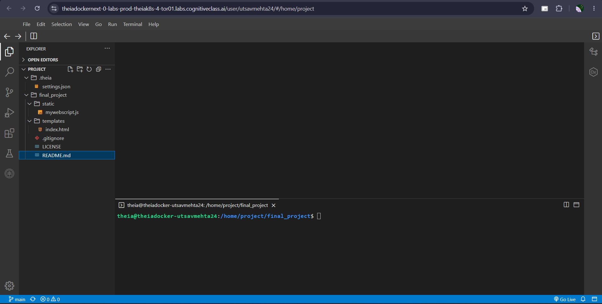

### 2. Emotion Detection Function

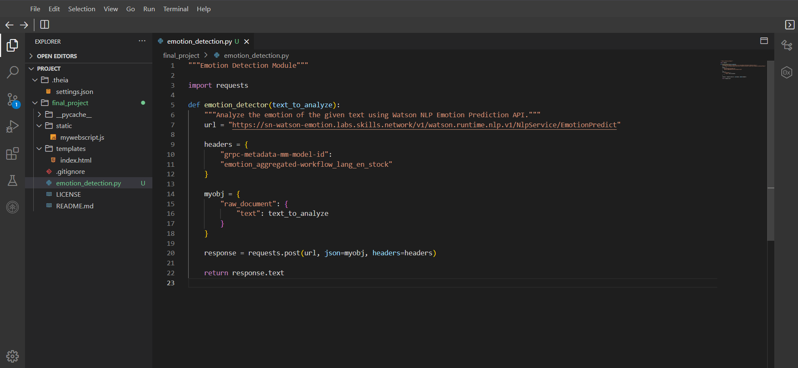

### 3. Application Creation

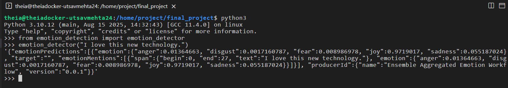

### 4. Output Formatting

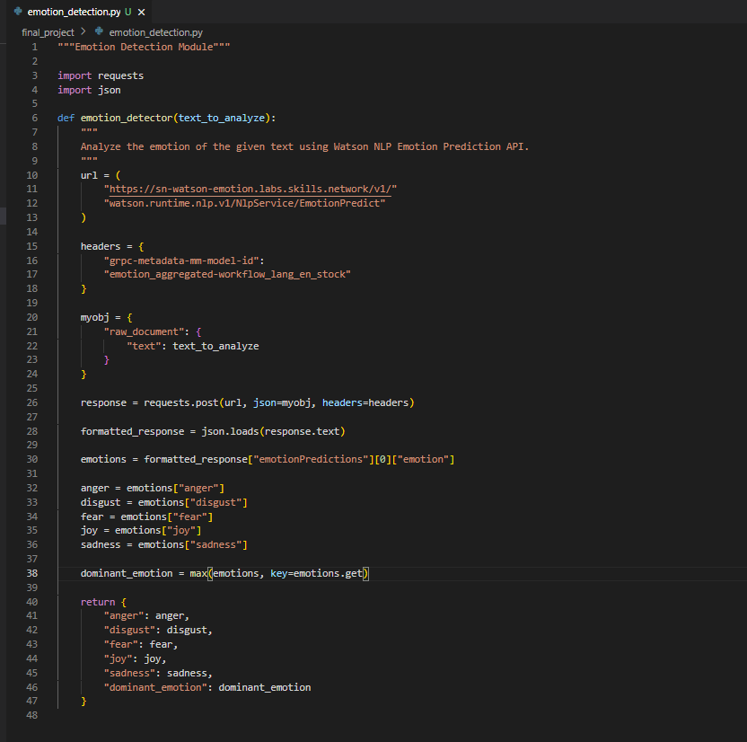

### 5. Formatted Output Test

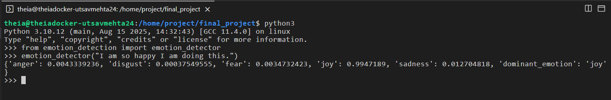

### 6. Packaging Structure

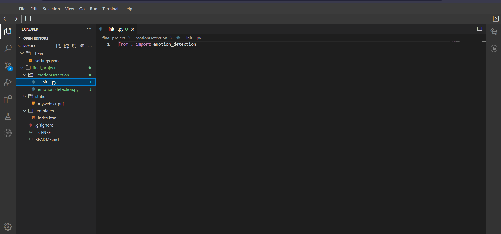

### 7. Packaging Validation

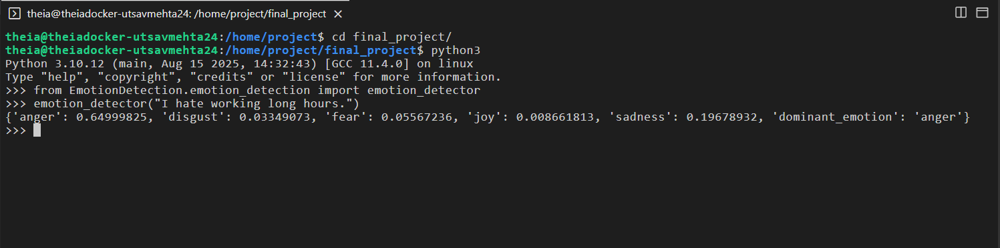

### 8. Unit Test Code

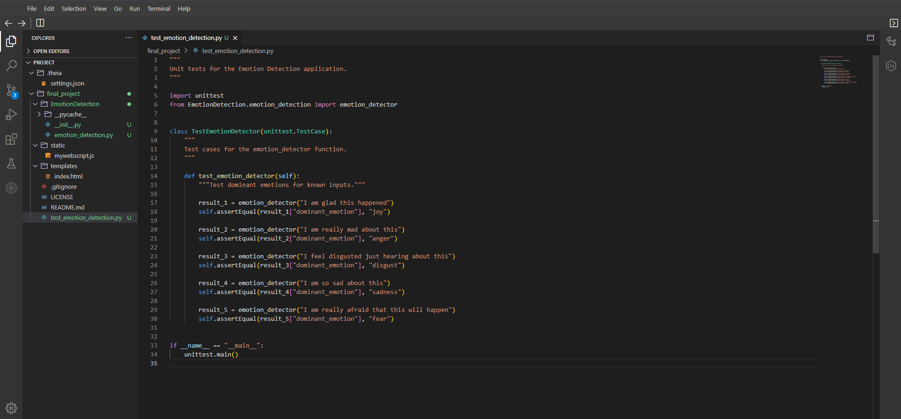

### 9. Unit Test Result

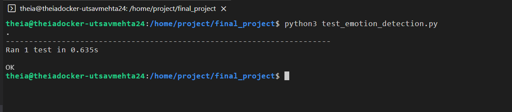

### 10. Flask Server

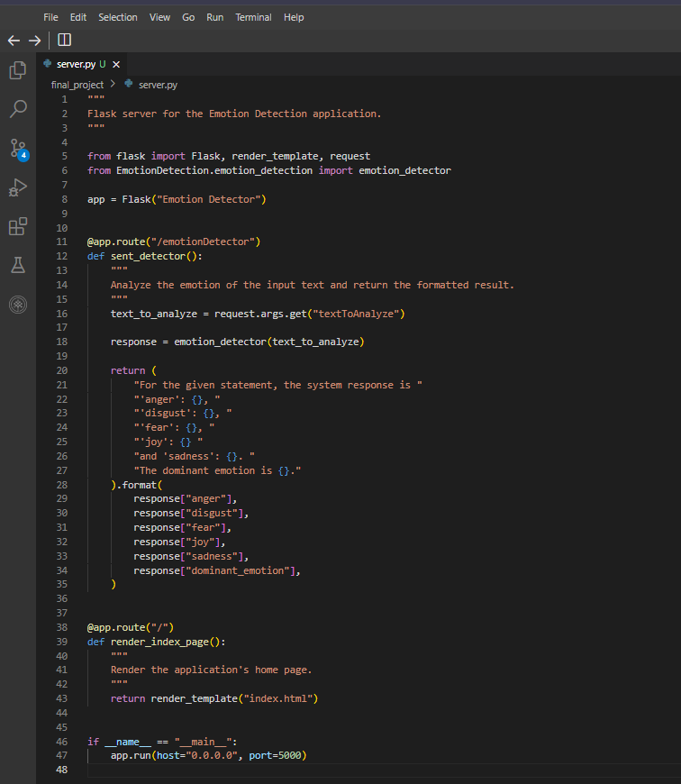

### 11. Web App Deployment

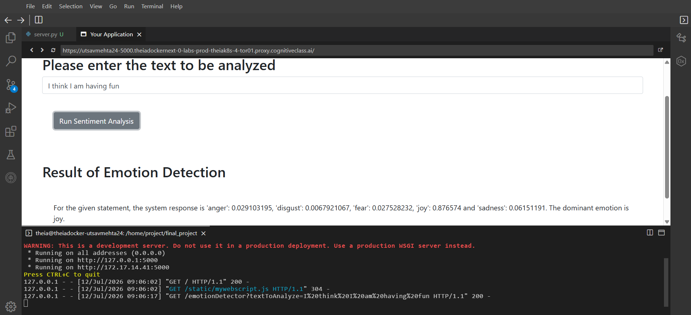

### 12. Error Handling Function

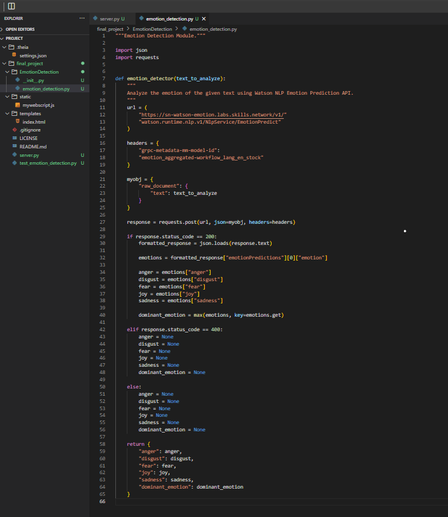

### 13. Error Handling Server

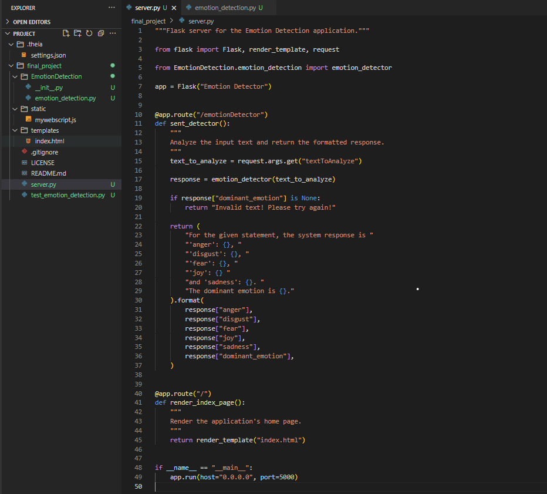

### 14. Invalid Input Demo

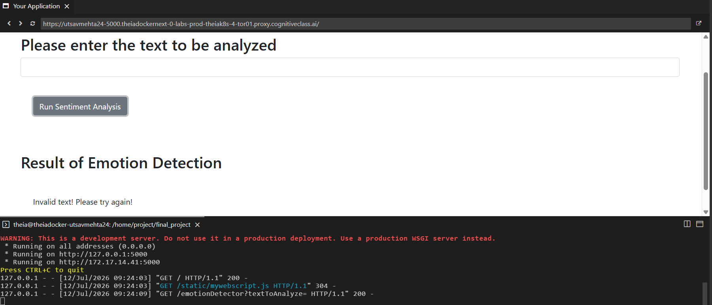

### 15. Final Server Implementation

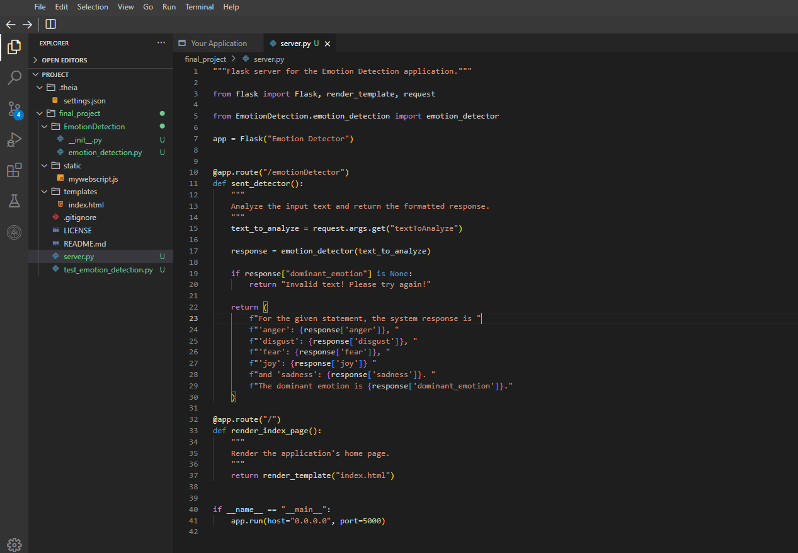

### 16. Static Analysis Result

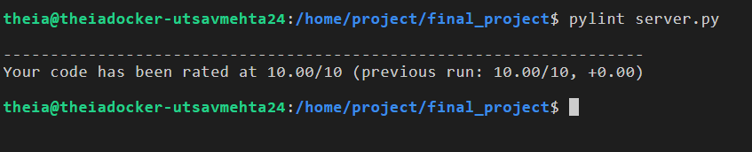

---

## Running Locally

1. Create and activate a virtual environment.
2. Install the dependencies:
   ```bash
   pip install -r requirements.txt
   ```
3. Start the Flask app:
   ```bash
   python server.py
   ```
4. Open the app in your browser at:
   ```text
   http://127.0.0.1:5000/
   ```

> Note: This project uses the IBM Watson Emotion API, so its behavior depends on the availability of that endpoint in your environment.

---

# 📚 Learning Outcomes

Through this project, I gained practical experience with:

- REST APIs
- Natural Language Processing
- Flask Web Development
- Python Packaging
- Unit Testing
- Error Handling
- Static Code Analysis
- Clean Code Practices

---

# 🔮 Future Improvements

- 🌍 Multi-language Emotion Detection
- 📊 Emotion Confidence Charts
- 📁 Prediction History
- ☁️ Cloud Deployment
- 🤖 Transformer-based Local Model
- 📱 Responsive UI

---

# 🌐 Connect With Me

- 🔗 LinkedIn: https://www.linkedin.com/in/utsav-mehta-462653258/
- 💻 GitHub: https://github.com/utsavmehta24
- 🌍 Portfolio: https://medium.com/@utsavmehta24072003
- 📧 Email: utsavmehta24072003@gmail.com
- 🐦 X (Twitter): https://x.com/Lucid24by7_io

---

<div align="center">
